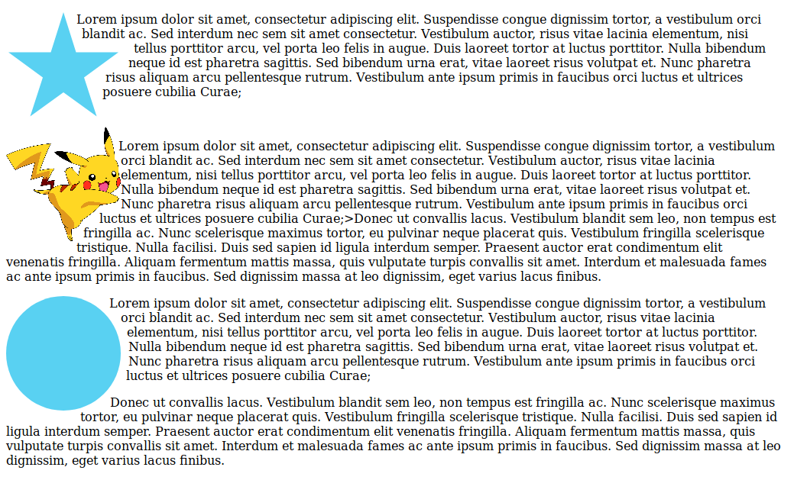

# html-css-shapes
Make Your Content Look More Interesting With CSS Shapes
* polygon() —The polygon() function allows you to “go crazy” and create any kind of shape. It gets as an argument, a list of at least 3 coordinates. This, for example, is how you would create a simple 5 pointed star:
```
.star-shape {
  width: 150px;
  height: 150px;
  shape-outside: polygon(50% 0%, 61% 35%, 98% 35%, 68% 57%, 79% 91%, 50% 70%, 21% 91%, 32% 57%, 2% 35%, 39% 35%);
  float: left;
}

```
Creating shapes by hand is a bit of a pain, so you can use online tools such as this one to generate the correct CSS, 
which you can just copy-paste to your project.

  *   url() — With this function you can create dynamic float borders from an image. 
    It only supports png/gif/svg formats thought. Also note that you need the actual image present as an  tag for it to work.
    
 ```
 
<p>some text...</p>
<style>
.custom-shape {
  float: left;
  shape-outside: url(some-image.png);
}
</style>
 ```
 
